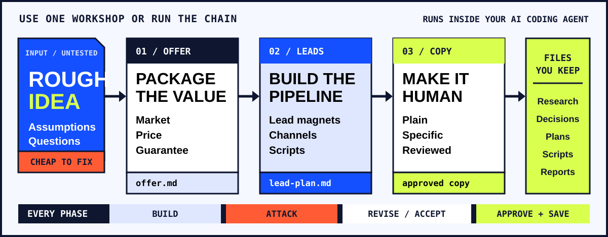

<picture>
  
</picture>

<p align="center">
  <a href="https://george-rd.github.io/growth-arsenal/"><strong>See how it works</strong></a>
  ·
  <a href="#install"><strong>Install</strong></a>
  ·
  <a href="https://ko-fi.com/george_builds"><strong>Support the project</strong></a>
</p>

# growth-arsenal

Three linked workshops turn a rough idea into an offer, a lead plan and customer copy. They run inside your AI coding agent.

Separate reviewers test each phase. Approved decisions and reports stay in your project.

<picture>
  <source media="(max-width: 640px)" srcset="docs/readme-system-mobile.svg" />
  
</picture>

Use one workshop or run all three. A phase clears only when no critical issue remains, or you accept the trade-off.

## Choose where to start

| You need to | Start with | You keep |
|---|---|---|
| Price and package an idea | [`grandslam-offer`](skills/grandslam-offer/) | Research, offer file and HTML reports |
| Build a lead plan you can use | [`hundred-million-leads`](skills/hundred-million-leads/) | Lead plan, scripts and a tracker |
| Make customer copy plain and human | [`business-copy-style`](skills/business-copy-style/) | Reviewed copy and comparison notes |

## Install

### Claude Code plugin

```text
/plugin marketplace add George-RD/growth-arsenal
/plugin install growth-arsenal@growth-arsenal
```

### Skills install

```bash
git clone https://github.com/George-RD/growth-arsenal
cd growth-arsenal
./install.sh codex   # claude | omp | opencode | agents
```

Supported harnesses: Claude Code, Oh My Pi, Codex, opencode and agents.md-style tools.

The install uses symlinks, so `git pull` updates the workshops in place. On Windows, copy the `skills/<name>` folders into the harness skills directory instead.

## Start with a plain request

```text
I run a small bookkeeping firm. Help me build an offer I can charge five times more for.
```

```text
I sell an online course for new parents. Build a lead generation system I can execute every day.
```

```text
Rewrite this landing page so it does not sound like AI wrote it.
```

The workshop will ask for what it needs and push back when the market, maths or message is weak.

## Limits

This does not replace talking to real customers. Dynamic personas catch obvious gaps, but they are not proof of demand. Real buyers still decide whether the offer works.

You do not need to read Alex Hormozi's books first. The workshops apply the relevant questions and formulas one phase at a time. This repository is an independent open-source implementation inspired by *$100M Offers* and *$100M Leads*.

## Contributing

Found a bug or a weak part of the workshop? [Open an issue](https://github.com/George-RD/growth-arsenal/issues). Pull requests are welcome. See `CLAUDE.md` for repository conventions.

## Licence

MIT. See `LICENSE`.
