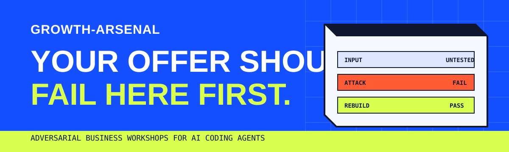

<picture>
  
</picture>

<p align="center">
  <a href="https://george-rd.github.io/growth-arsenal/"><strong>See how it works</strong></a>
  ·
  <a href="#install"><strong>Install</strong></a>
  ·
  <a href="https://ko-fi.com/george_builds"><strong>Support the project</strong></a>
</p>

# growth-arsenal

Business growth workshops that run inside your AI coding agent.

A normal chat helps you improve an idea. growth-arsenal tries to break it. Independent agents test the market, pricing, margins, message and execution plan at every phase. Approved decisions are written to files as the workshop runs.

## What is inside

| Workshop | What it does | Main output |
|---|---|---|
| **grandslam-offer** | Builds the market, price, value equation, offer stack, guarantee and name. A sceptical marketer, business strategist and dynamic customer personas review each phase. | Research brief, offer file and HTML dashboards |
| **hundred-million-leads** | Builds lead magnets, chooses channels, writes outreach and lays out a Rule of 100 plan. Customer personas receive the scripts as prospects. | Lead-generation blueprint, scripts and tracking plan |
| **business-copy-style** | Runs customer-facing copy through plain-language, de-AI and adversarial reader checks. The other workshops call it automatically. | Clearer copy that is ready for a human edit |

The workshops can run independently. Together they form a chain from rough idea to offer, acquisition plan and final copy.

## How the pressure test works

1. **Build:** research missing facts and draft one phase.
2. **Attack:** independent agents review the same output in parallel.
3. **Converge:** shared concerns become must-fix issues.
4. **Persist:** approved decisions are written to Markdown and HTML files.

A phase passes only when no critical issue remains, or when you explicitly accept the trade-off.

## Install

### Claude Code plugin

```text
/plugin marketplace add George-RD/growth-arsenal
/plugin install growth-arsenal@growth-arsenal
```

### Skills install

```bash
git clone https://github.com/George-RD/growth-arsenal
cd growth-arsenal
./install.sh codex   # claude | omp | opencode | agents
```

Supported harnesses: Claude Code, Oh My Pi, Codex, opencode and agents.md-style tools.

The install uses symlinks, so `git pull` updates the workshops in place. On Windows, copy the `skills/<name>` folders into the harness skills directory instead.

## Start with a plain request

```text
I run a small bookkeeping firm. Help me build an offer I can charge five times more for.
```

```text
I sell an online course for new parents. Build a lead generation system I can execute every day.
```

```text
Rewrite this landing page so it does not sound like AI wrote it.
```

The workshop will ask for what it needs. It will push back when the market, maths or message is weak.

## What it does not do

This does not replace talking to real customers. Dynamic personas catch obvious gaps, but they are not proof of demand. Real buyers still decide whether the offer works.

You do not need to read Alex Hormozi's books first. The workshops apply the relevant questions and formulas one phase at a time. This repository is an independent open-source implementation inspired by *$100M Offers* and *$100M Leads*.

## Contributing

Found a bug or a weak part of the workshop? [Open an issue](https://github.com/George-RD/growth-arsenal/issues). Pull requests are welcome. See `CLAUDE.md` for repository conventions.

## Licence

MIT. See `LICENSE`.
